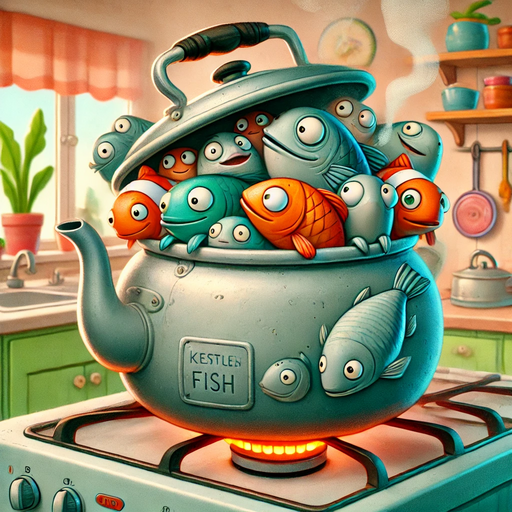

# YAKOF (Yet Another Kettle of Fish)



[](https://github.com/bassosimone/yakof/actions) [](https://codecov.io/gh/bassosimone/yakof)

YAKOF demonstrates improved typing and tensor manipulation for sustainability modeling,
and specifically for the [Fondazione Bruno Kessler's](https://fbk.eu) [DT Model](
https://github.com/tn-aixpa/dt-model) model. See [DESIGN.md](DESIGN.md) for the detailed
architecture and rationale.

## Quick Start

We use [uv](https://github.com/astral-sh/uv) for managing the development environment.

To get started, run:

```bash
git clone https://github.com/bassosimone/yakof
cd yakof
uv venv
source .venv/bin/activate
uv sync --dev
uv pip install -e .
```

## Examples

The `examples/` directory contains demonstrations of key features:
- `cafe.py`: Multi-dimensional café sustainability analysis
- `traffic.py`: Time series analysis with uncertainty

Run using:

```bash
python examples/cafe.py
python examples/traffic.py
```

## License

```
SPDX-License-Identifier: Apache-2.0
```
